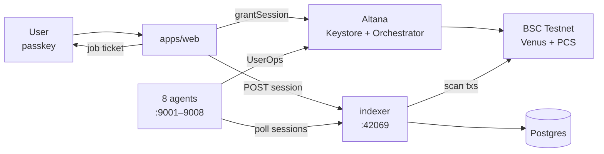
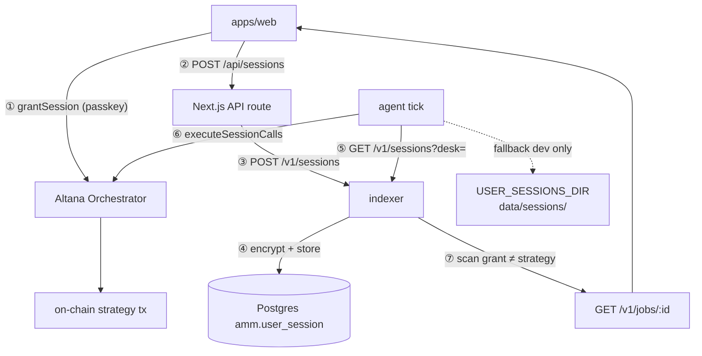
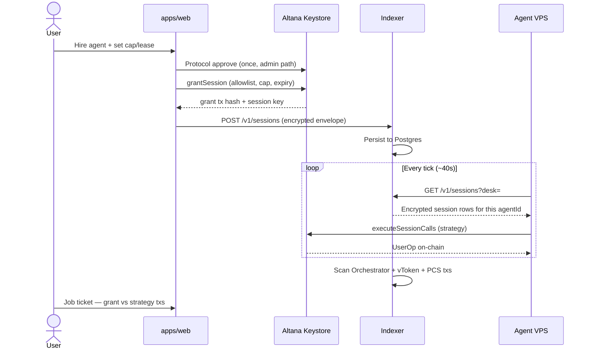

# Am-M

**Hire a DeFi agent. You keep the keys.**

BNB Chain testnet marketplace for four DeFi job desks — hire with Altana passkey sessions (allowlist + spend cap), agents execute inside your vault, and job tickets index grant txs separately from on-chain strategy deliverables.
| | |
|---|---|
| **Hackathon** | [The Smart Money Era](https://www.bnbchain.org/en/hackathons/smart-money-era) |
| **Chain** | BSC Testnet (97) — execution; BSC Mainnet (56) — APR/tick context only |
| **PRD** | [`docs/PRD.md`](docs/PRD.md) |
| **Run locally** | [`docs/RUNNING.md`](docs/RUNNING.md) |
| **VPS deploy** | [`docs/DEPLOY.md`](docs/DEPLOY.md) |

---

## What this is

Am-M is not an ERC-8004 directory — it is a **job desk** with four DeFi desks:

| Desk | Agent (conservative) | Agent (aggressive) | Protocol |
|------|----------------------|--------------------|----------|
| **Guard** | `healthfactor` | `healthfactoragg` | Venus — repay/mint when HF is low |
| **Rebalance** | `rebalancing` | `rebalancingagg` | PancakeSwap V3 NFPM — LP WBNB/USDT fee-100 |
| **Grid** | `gridtrading` | `gridtradingagg` | PancakeSwap V3 SwapRouter — synthetic grid |
| **Yield** | `yieldrouter` | `yieldrouteragg` | Venus Core Pool — mint/rotate vToken |

Eight sellers = 4 desks × 2 risk profiles. One strategy codebase (`packages/agent-strategy`), different parameters via `AGENT_VARIANT`.

**Trust model:** users see exactly which functions are **allowed** and **denied**; Keystore grant ≠ strategy tx; the indexer verifies recipients stay on the user vault.

---

## Architecture

### Overview



### Session path (hire → agent)



Dashed lines (`-.->`) are **optional** — agents can read local JSON files when the indexer is down or during local dogfooding without a VPS. In production, steps **②→⑤** go through the indexer only.

### Hire flow (sequence)



### Three data layers

| Layer | Source | Used for |
|---------|--------|---------------|
| **Context** | BSC mainnet via indexer | Venus APR, PCS tick in market UI |
| **Live** | `GET /strategy` per agent | Agent status, last action |
| **Proof** | Ponder + `session_scan` | Job ticket: grant tx, strategy tx count, recipients verified |

---

## Repo layout

```
Am-M/
├── apps/
│   ├── web/                 # Marketplace FE (Next.js) — hire, account, jobs
│   ├── indexer/             # Ponder indexer + REST API (/v1/sessions, /v1/jobs)
│   └── docs/                # Docs site (Turbo scaffold)
├── packages/
│   └── agent-strategy/      # Shared DeFi logic — Venus, PCS, permissions, tick loops
├── agents/                  # 8 seller workspaces (outside pnpm Turbo root)
│   ├── healthfactor/
│   ├── rebalancing/
│   ├── gridtrading/
│   ├── yieldrouter/
│   └── *agg/                # Aggressive variants (symlink to conservative)
├── data/sessions/           # Local dev fallback for user session files
├── ecosystem.config.cjs     # pm2 — 8 agents + indexer
├── docker-compose.yml       # Postgres
└── docs/                    # PRD, RUNNING, DEPLOY
```

> **Important:** `pnpm dev` at the repo root only runs **Next.js**. Agents run separately via `bag dev` or pm2 — see [`docs/RUNNING.md`](docs/RUNNING.md).

---

## Tech stack

| Layer | Technology |
|---------|-----------|
| Frontend | Next.js 15, React, Tailwind, Altana SDK |
| Agents | BNB Agent Studio (`bag` CLI), Node ≥ 22 |
| Strategy | `@am-m/agent-strategy` — viem, Venus API, PCS V3 |
| Indexer | [Ponder](https://ponder.sh), Postgres |
| Auth / tx | Altana passkey smart accounts + Keystore sessions |
| Identity | ERC-8004 (8004scan) |
| Commerce | ERC-8183 $U retainer (optional at hire) |
| Deploy | pm2, nginx, Docker Compose |

---

## Quick start (marketplace FE)

```bash
# Prerequisite: Node ≥ 24, pnpm
pnpm install

# apps/web/.env — copy from example, set INDEXER_URL + secrets
pnpm --filter web dev
# → http://localhost:3000
```

### Local indexer (optional)

```bash
cp apps/indexer/.env.example apps/indexer/.env
docker compose up -d postgres
pnpm --filter indexer dev
# API → http://127.0.0.1:42069
```

### One local agent

```bash
cd agents/healthfactor
cp .env.example .studio/.env.local   # set WALLET_PASSWORD, 9router
cd app/agent && bag wallet new       # fund tBNB + $U
bag wallet session grant --force --budget-u 5 --expiry-days 90 --yes
cd ../.. && bag dev                  # → :9001
```

Full details: [`docs/RUNNING.md`](docs/RUNNING.md).

---

## Production deploy

| Surface | URL |
|---------|-----|
| **Marketplace (frontend)** | https://www.ammlabs.fun/ |

Eight agent subdomains + one indexer behind nginx:

| Agent | URL |
|-------|-----|
| healthfactor | https://healthfactor.ammlabs.fun/ |
| rebalancing | https://rebalancing.ammlabs.fun/ |
| gridtrading | https://gridtrading.ammlabs.fun/ |
| yieldrouter | https://yieldrouter.ammlabs.fun/ |
| healthfactoragg | https://healthfactoragg.ammlabs.fun/ |
| rebalancingagg | https://rebalancingagg.ammlabs.fun/ |
| gridtradingagg | https://gridtradingagg.ammlabs.fun/ |
| yieldrouteragg | https://yieldrouteragg.ammlabs.fun/ |
| Indexer API | https://healthfactor.ammlabs.fun/indexer/ |

```bash
pm2 start ecosystem.config.cjs
pm2 save
```

VPS guide, nginx, env, Ponder schema reset: [`docs/DEPLOY.md`](docs/DEPLOY.md).

---

## Environment variables

### `apps/web/.env`

| Variable | Description |
|----------|-----------|
| `INDEXER_URL` | Indexer base URL (no trailing slash) |
| `INDEXER_SECRET` | Shared secret for POST session to indexer |
| `SESSION_KEY_ENCRYPTION_KEY` | 32-byte hex — encrypt session key at rest |

### `apps/indexer/.env`

| Variable | Description |
|----------|-----------|
| `DATABASE_URL` | Postgres connection string |
| `INDEXER_SECRET` | Must match web |
| `SESSION_KEY_ENCRYPTION_KEY` | Must match web |
| `BNB_TESTNET_RPC_URL` | BSC testnet RPC |
| `PONDER_START_BLOCK_97` | Optional — backfill start block |

### `agents/<name>/.studio/.env.local`

| Variable | Description |
|----------|-----------|
| `WALLET_PASSWORD` | Agent admin keystore (**do not commit**) |
| `NINEROUTER_API_KEY` | LLM routing (9router) |
| `INDEXER_URL` | Poll user sessions from indexer each tick |

---

## Four keys (do not confuse)

| Component | Holder | Role |
|----------|----------|--------|
| Altana wallet **user** | User, passkey | Vault + DeFi positions |
| Session **user→agent** | Indexer + agent VPS | Narrow permission on user vault |
| Altana wallet **agent** | Team, admin keystore | ERC-8004, receive $U, agent gas |
| Session **agent** | Agent runtime | Not the admin keystore |

---

## Scripts

```bash
pnpm build              # turbo build all apps/packages
pnpm --filter web dev   # marketplace FE
pnpm --filter indexer dev
pnpm lint
pnpm format
```

Agent build (VPS):

```bash
cd packages/agent-strategy && pnpm build
cd agents/yieldrouter/app/agent && pnpm build
pm2 restart yieldrouter indexer
```

---

## Documentation

| Document | Contents |
|---------|-----|
| [`docs/PRD.md`](docs/PRD.md) | Product requirements, hackathon strategy |
| [`docs/RUNNING.md`](docs/RUNNING.md) | Run agents + FE locally |
| [`docs/DEPLOY.md`](docs/DEPLOY.md) | VPS, pm2, nginx, Postgres, troubleshooting |
| [`apps/web/FRONTEND_PRD.md`](apps/web/FRONTEND_PRD.md) | Routes & UI spec |

---

## License

Private — hackathon submission. Contact the maintainer before redistribution.
